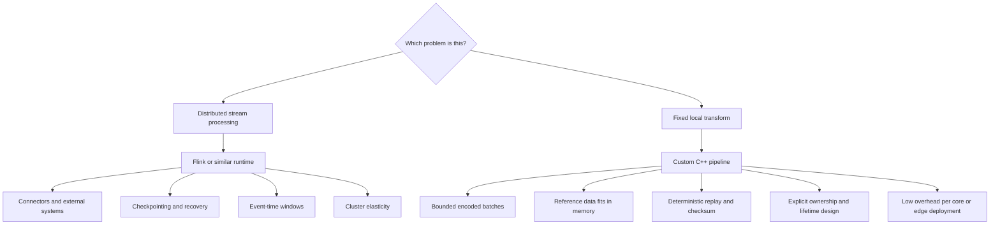
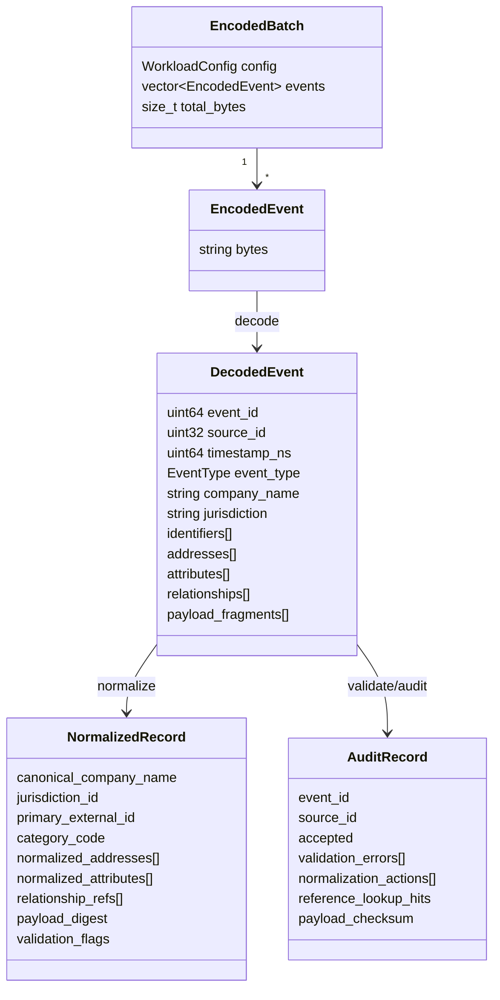
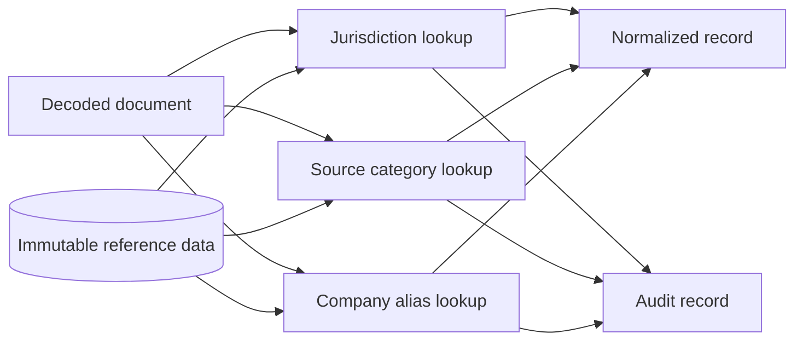
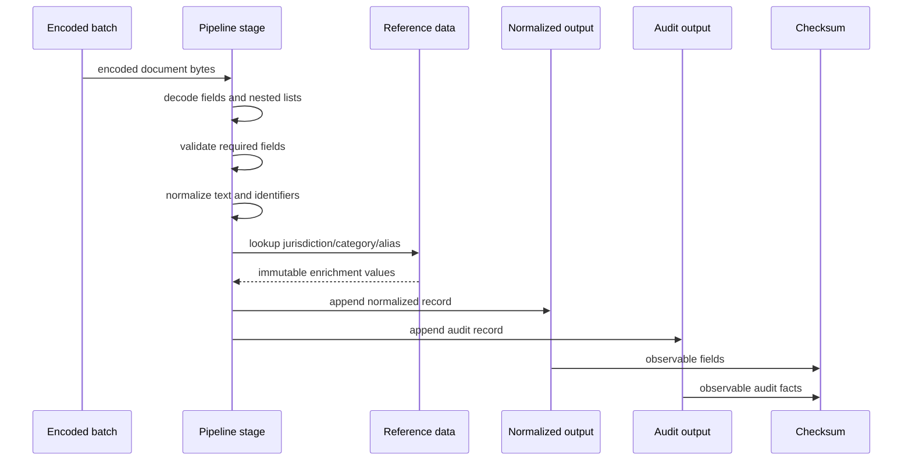
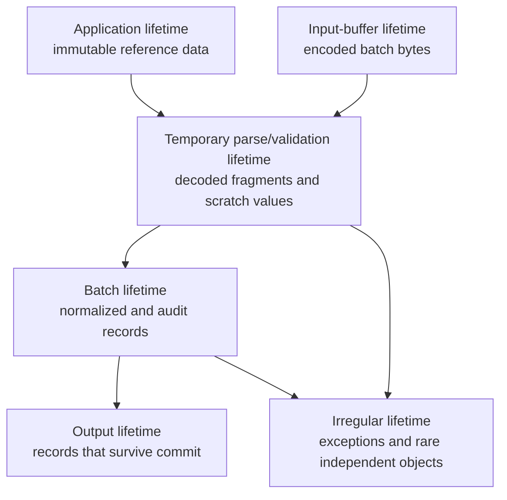

# Domain Model

The project models a high-throughput business document pipeline. The workload is intentionally similar to a narrow Flink job: encoded business documents arrive in batches, each document is decoded, validated, normalized, enriched from immutable reference data, and emitted as normalized output plus an audit trail.

The project does not model distributed execution, external connectors, checkpointing, networking, or storage. That boundary is deliberate. The article studies what happens when the transform is narrow enough to own inside one process and the main engineering question becomes data representation, ownership, allocation, and lifetime.

## Why Not Flink?

Flink, Spark, Beam, and similar systems are the right tools when the system needs distributed execution, operational connectors, event-time windows, checkpointing, recovery, cluster elasticity, and mature runtime controls. This project is not a replacement for that class of system.

The custom C++ pipeline represents a different corner of the design space. It is plausible when input already arrives in bounded batches, reference data fits in memory, the transform is stable, deterministic replay is sufficient, deployment needs a small native component, or infrastructure cost and per-core efficiency matter more than distributed flexibility.

The article should therefore avoid the claim that C++ is categorically better than a stream processor. The more precise claim is that general stream processors optimize for distributed correctness and operational flexibility, while this project studies a fixed business transform with aggressive control over memory lifetime inside one process.

## Business Documents

Each generated record is an encoded business document. It contains stable scalar fields, business identity, nested collections, and payload fragments. The encoding is intentionally simple because external I/O and wire-format parsing are not the subject of the first article.

## Reference Data

Reference data is immutable for the duration of a pipeline run. It models application-lifetime data that would normally come from configuration, a database snapshot, or a broadcast state source in a distributed runtime.

Current reference data includes:

- jurisdiction code to jurisdiction id;
- source system id to category code;
- company-name aliases used during normalization.

## Processing Semantics

Every implementation stage must perform the same business work:

1. Decode the deterministic encoded document.
2. Validate required fields.
3. Normalize selected text values.
4. Enrich from immutable reference data.
5. Construct normalized records.
6. Construct audit records.
7. Compute a stable checksum.
8. Release or reset batch-local state.

## Lifetime Categories

The lifetime model is central to the article. Later stages are allowed to change internal representation only when they preserve these boundaries.

Borrowed memory must identify its owner and lifetime boundary. No stage may rely on dangling `std::string_view`, `std::span`, pointer, or index assumptions.

