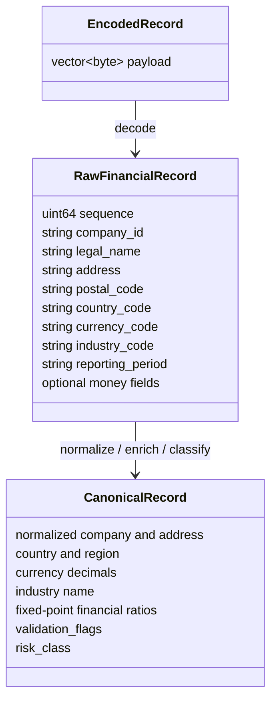
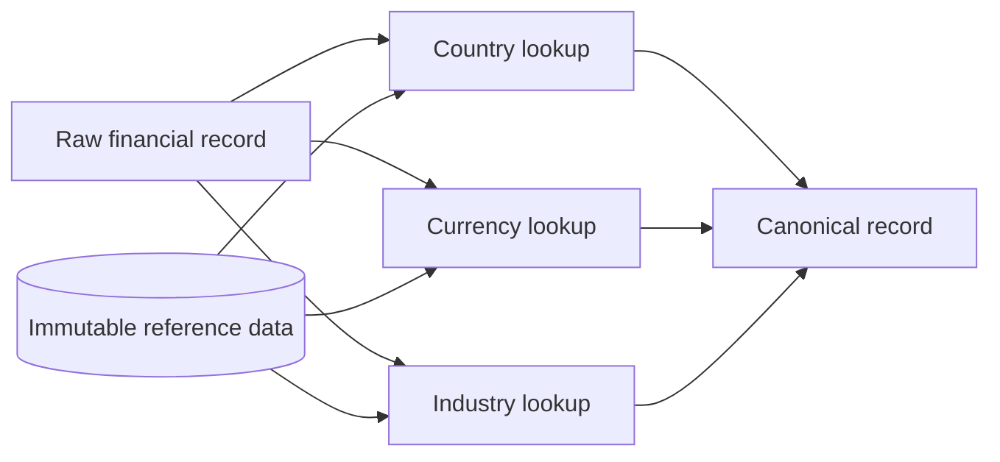

# Domain Model

The project models a local financial-record transform. Encoded company financial records are decoded, normalized, enriched from immutable reference data, checked for accounting validity, classified, and emitted as canonical records with a stable checksum. External infrastructure is intentionally absent in the current architecture so the measurements focus on representation, ownership, allocation, batching, and worker coordination inside one process.

## Financial Record

Each input record contains a compact but realistic subset of company financial data:

- company identifier, legal name, address, postal code, country, currency, industry, and reporting period;
- revenue, operating profit, net income, current assets, current liabilities, total assets, total debt, shareholder equity, previous revenue, and previous profit;
- malformed or missing values generated deterministically so validation and exceptional paths are measured consistently.

The wire representation is shared through `financial::common::EncodedRecord`. The three solutions may decode it into different internal shapes, but they must apply the same business rules and produce equivalent `financial::common::CanonicalRecord` output.

## Reference Data

Reference data has application lifetime and is immutable during a run. It contains country names and regions, canonical country currencies, currency decimal conventions, industry names, industry risk coefficients, and country risk coefficients. The oracle reads it directly, and the visible parallel implementations share it safely because no stage mutates it.

## Business Semantics

Every solution performs the same observable work:

1. Decode encoded input bytes into record fields.
2. Normalize company-name whitespace and casing, address whitespace, common street abbreviations, postal-code formatting, and country/currency/industry codes.
3. Enrich from immutable country, currency, and industry data.
4. Compute operating margin, net margin, current ratio, debt-to-equity, return on assets, revenue growth, profit growth, and a transparent composite risk class.
5. Mark missing, unknown, non-finite, negative, zero-denominator, and inconsistent accounting values explicitly.
6. Emit canonical records and compute a stable checksum.

Ratios are rounded into fixed-point basis points in the canonical output. This keeps equivalence testing deliberate instead of relying on accidental text formatting of floating-point values.

## Lifetime Categories

The implementation and article distinguish these lifetimes:

- immutable application-lifetime reference data;
- input-buffer lifetime for encoded records;
- temporary parsing and validation data;
- batch-lifetime normalized strings and scratch state in the lifetime-optimized solution;
- canonical output that must survive the batch for checksum and comparison;
- exceptional objects with irregular independent lifetimes.

Borrowed memory must identify its owner and lifetime boundary. No `std::string_view`, `std::span`, raw pointer, or index may survive the storage it depends on.
