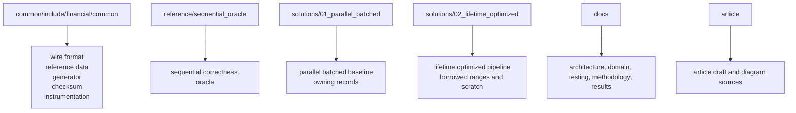
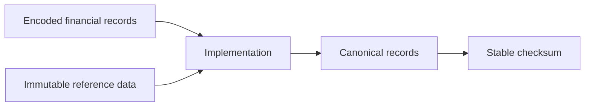
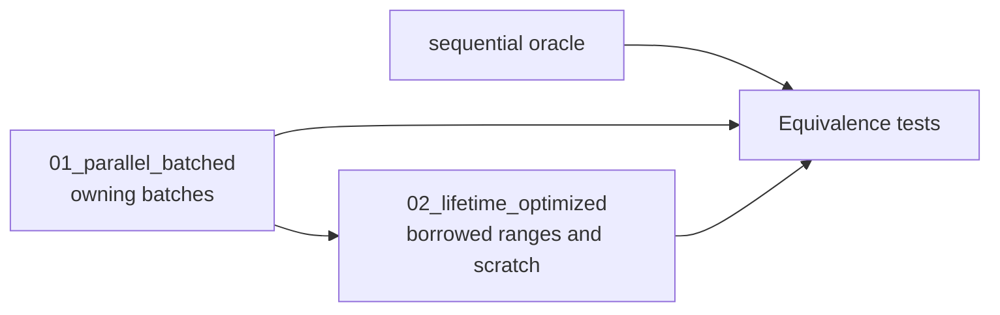
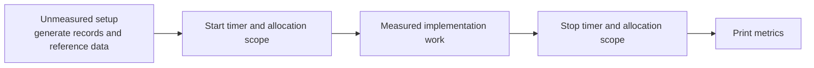

# Software Architecture

The repository is organized around a correctness oracle and two independently browsable financial-record implementations. Shared code exists only for contracts that make comparison fair: encoded input, deterministic workload generation, immutable reference data, stable checksums, benchmark metric fields, and allocation instrumentation.

## Source Layout

The processing pipeline, queue abstraction, worker architecture, internal record representation, and memory strategy are not shared by the two visible solutions. Those are the design choices the project compares.

## Shared Contract

Each implementation accepts the same `std::vector<financial::common::EncodedRecord>`, reads the same immutable `financial::common::ReferenceData`, and returns canonical records plus a stable checksum. Equivalence is defined by `financial::common::CanonicalRecord`, not by internal objects.

## Implementations

`reference/sequential_oracle` is the test oracle. It processes one record at a time with ordinary owning C++ objects and no worker coordination. It exists to make semantic regressions easier to debug, not as an article-facing throughput stage.

`solutions/01_parallel_batched` is the competent baseline. It uses worker threads, a bounded queue, explicit backpressure, batch work items, preserved output ordering, conventional owning record objects, and general heap allocation. Queue entries own a vector of encoded records, so this stage batches coordination without introducing borrowed input lifetime rules.

`solutions/02_lifetime_optimized` keeps the same external contract and batch boundary, then changes data movement and lifetime. Queue entries carry input index ranges, workers own reusable scratch state, temporary normalized strings can be allocated from a batch-reset `std::pmr::monotonic_buffer_resource`, and canonical output remains owning because it must survive the batch.

## Measured Region

Benchmark executables construct deterministic input and immutable reference data before the timed region. The timed region includes decode, normalization, enrichment, financial calculations, validation, canonical output construction, checksum protection, allocation effects, and any queue or worker coordination used by that implementation.

## Benchmark Integrity

The comparison is valid only while input bytes, reference data, normalization rules, validation rules, financial formulas, canonical output, and checksum semantics remain equivalent. A faster implementation that changes the checksum is a failed implementation, not a performance result.

The article should not argue that batching is surprising. The baseline is already batched. The central question is what remains after parallelism and batching are present: copying, temporary ownership, allocator behaviour, cache locality, and lifetime boundaries.
