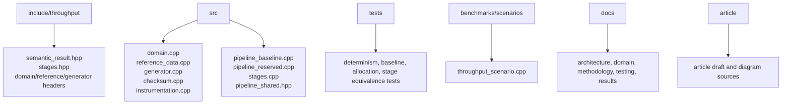
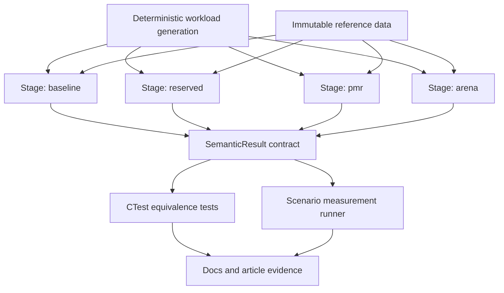
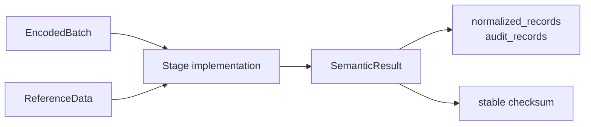
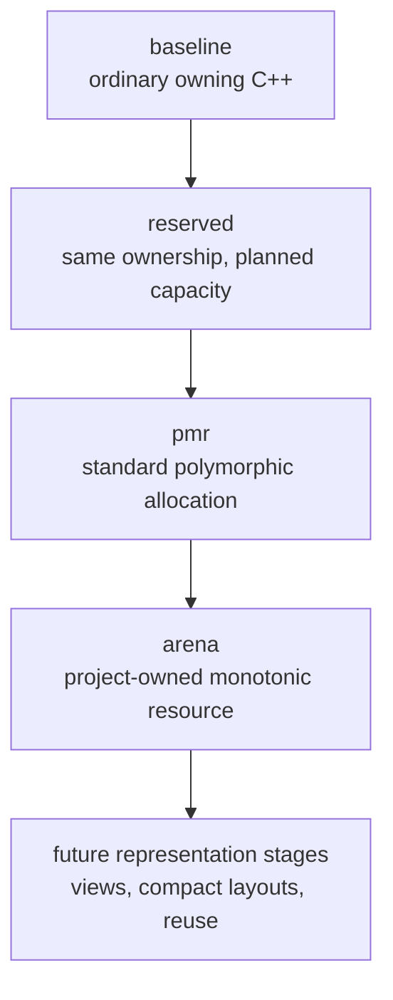
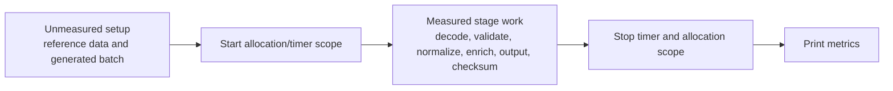
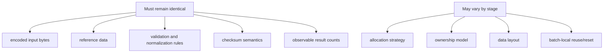

# Software Architecture

The repository is organized around an article-friendly separation: stable semantics, stage implementations, measurement harnesses, and evidence. The code should make it difficult to change business behaviour accidentally while making it easy to compare memory and representation choices.

## Source Layout

## Layering

The stable layer defines what the pipeline means. Stage implementations define how that work is represented and allocated. The scenario runner and tests consume stage entry points through the semantic contract.

## Stage Contract

Each stage accepts the same encoded batch representation and immutable reference data. It may use different internal containers, allocation resources, or temporary representations, but it must emit behaviourally equivalent observable results.

The project currently keeps the original `PipelineResult` for the owning baseline API. The cross-stage API is `SemanticResult`, because later optimized stages should not be forced to expose the baseline object graph.

## Stage Roadmap

The sequence isolates variables:

- `baseline` establishes readable, idiomatic behaviour.
- `reserved` asks how much obvious capacity planning helps without changing ownership.
- `pmr` asks what batch-lifetime allocation changes when containers remain familiar.
- `arena` asks whether a project-owned resource gives different behaviour from standard PMR machinery.
- Future representation stages should change only one major variable at a time.

## Measured Region

The scenario runner constructs the reference data and generated input before measurement. The measured region contains only stage processing and checksum construction.

## Benchmark Integrity

The architecture exists to protect benchmark integrity. The same generated input, reference data, validation rules, normalization rules, and checksum rules must be used by every stage.

