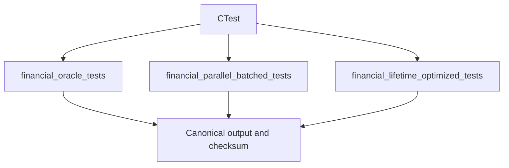

# Testing And Verification

Testing protects ordinary correctness and benchmark comparability. The oracle and both visible solutions must process the same encoded records, apply the same business rules, and produce equivalent canonical output before their measurements are compared.

## Build And Test Commands

Default preset:

```powershell
cmake --preset default
cmake --build --preset default
ctest --preset default
```

Visual Studio multi-config preset:

```powershell
cmake --preset msvc
cmake --build --preset msvc-release
ctest --preset msvc-release
```

## Test Suites

CTest currently runs:

- `financial_oracle_tests`: deterministic oracle processing, validation edges, normalization, enrichment, and checksum stability.
- `financial_parallel_batched_tests`: equivalence with the oracle, deterministic output across worker counts and batch sizes, ordering preservation, and bounded-queue backpressure.
- `financial_lifetime_optimized_tests`: equivalence with the oracle, deterministic output across batch sizes, heap versus arena-mode equivalence, and bounded batch queue observations.



## Benchmark Smoke Commands

Default preset:

```powershell
.\build\default\bin\financial_oracle_benchmark.exe 10000
.\build\default\bin\financial_parallel_batched_benchmark.exe 10000 4 32 64
.\build\default\bin\financial_lifetime_optimized_benchmark.exe 10000 4 32 64 arena
```

Visual Studio preset:

```powershell
.\build\msvc\bin\Release\financial_oracle_benchmark.exe 10000
.\build\msvc\bin\Release\financial_parallel_batched_benchmark.exe 10000 4 32 64
.\build\msvc\bin\Release\financial_lifetime_optimized_benchmark.exe 10000 4 32 64 arena
```

Current reported fields include record counts, input and output bytes, elapsed time, records per second, allocation count, allocated bytes, and checksum. The visible solutions also report worker count, queue capacity, batch size, maximum queue occupancy, producer and consumer waits, and wait time. The lifetime-optimized benchmark also reports allocation mode.

## Interpreting Failures

A checksum mismatch means an implementation changed observable business behaviour. Fix equivalence before interpreting any timing or allocation data.

An allocation-count increase is not automatically a correctness failure. It is evidence. The article should preserve cases where PMR, arenas, batching, reserving, or reduced-copy designs do not help.

Timing from the current benchmark executables is preliminary. Accepted article results should include repeated samples, environment metadata, stable release builds, and clear separation between instrumented and non-instrumented runs if allocation instrumentation distorts timing.
