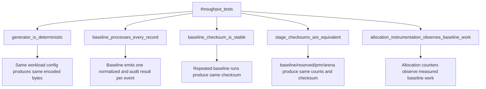
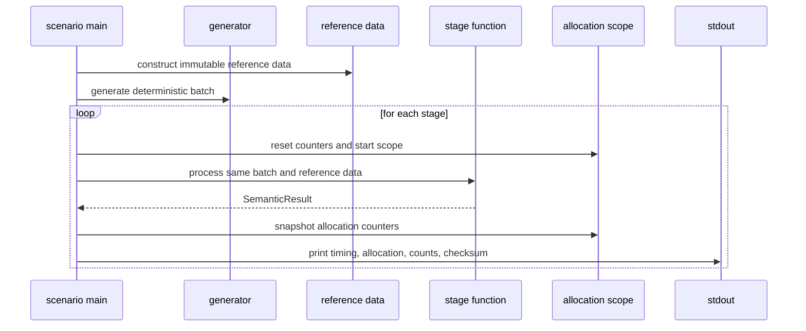
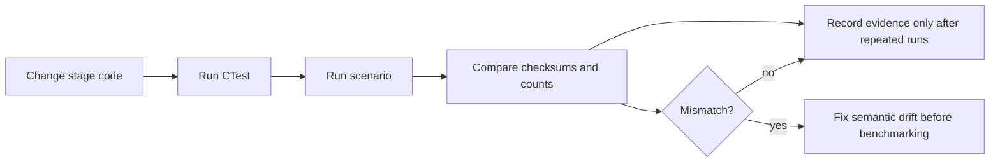

# Testing And Verification

Testing serves two purposes in this repository. First, it checks ordinary correctness: deterministic generation, record counts, checksums, and allocation instrumentation. Second, it protects the article by proving that stages remain behaviourally equivalent before their measurements are compared.

## Build And Test Commands

Default preset:

```powershell
cmake --preset default
cmake --build --preset default
ctest --preset default
```

Visual Studio multi-config preset:

```powershell
cmake --preset msvc
cmake --build --preset msvc-release
ctest --preset msvc-release
```

If the default preset fails with a Ninja error, install Ninja or use a configured Visual Studio generator. If the MSVC preset fails with no C++ compiler, run from a Developer PowerShell or install the C++ workload for Visual Studio.

## What The Tests Cover



The most important article-protection test is `stage_checksums_are_equivalent`. A stage may be faster or slower, allocate more or less, and retain memory differently, but it cannot change the observable business result.

## Scenario Runner

The scenario runner is not a full benchmark suite. It is a deterministic measurement foundation that proves the measured-region boundary, allocation instrumentation, and per-stage output reporting.

Default preset executable:

```powershell
.\build\default\bin\throughput_scenario.exe
```

Visual Studio preset executable:

```powershell
.\build\msvc\bin\Release\throughput_scenario.exe
```

Current reported fields:

- `stage`
- `records`
- `input_bytes`
- `elapsed_seconds`
- `records_per_second`
- `allocations`
- `allocated_bytes`
- `deallocations`
- `deallocated_bytes`
- `normalized_records`
- `audit_records`
- `checksum`



## Expected Manual Checks

After changing any stage implementation:

1. Run `ctest --preset default` or `ctest --preset msvc-release`.
2. Run the scenario executable.
3. Confirm all stages report the same `records`, `normalized_records`, `audit_records`, and `checksum`.
4. Inspect allocation and throughput differences without assuming the optimized stage should win.
5. Record repeated runs only when the benchmark methodology requirements are met.



## Interpreting Failures

A checksum mismatch means the stage changed observable business behaviour. Do not explain it as a performance result. Fix equivalence first.

An allocation-count regression is not automatically a correctness failure. It is evidence. The article should preserve cases where PMR, arena allocation, reserving, or representation changes do not help.

Timing from the scenario runner should be treated as preliminary. Accepted article results should include repeated samples, environment metadata, and clear separation between instrumented and non-instrumented runs if allocation instrumentation distorts timing.

